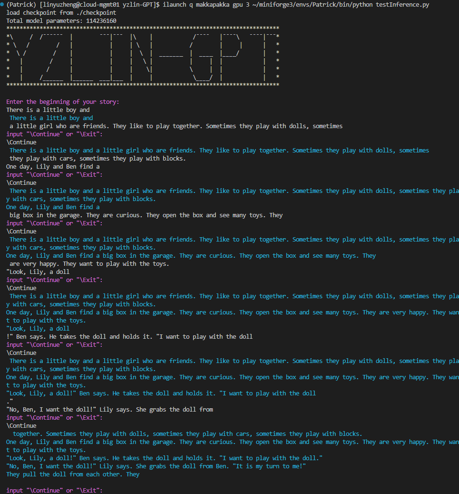

# yzlin-GPT
FDU-2024-Autumn AI-Design Course Mid-Term Project

## 0. Reference
- https://github.com/rasbt/LLMs-from-scratch
- https://github.com/karpathy/nanoGPT/tree/master
- https://github.com/REXWindW/my_llm

## 1. 项目文件结构

```plaintext
.
├── datasets/
│   ├── TinyStories-cut.txt # 使用的文本数据
│   ├── train.bin # TinyStories-cut.txt经过prepare.py得到训练数据
│   └── val.bin # # TinyStories-cut.txt经过prepare.py得到验证数据
├── checkpoint/
│   └── checkpoint.pt # 训练后的模型，取val_loss最优模型保存
├── prepare.py # txt文本数据处理脚本，用9:1生成训练与验证数据
├── model.py # 模型定义文件
├── train.py # 训练脚本
├── testInference.py # 文本生成功能测试脚本
├── trainInfo.log # 训练过程记录
└── README.md # 您正在看着
```

## 2. 简介
本项目主要参考NanoGPT架构格式与训练方法进行本项目，由于时间与显存限制，在

[词嵌入维度768, 8层8头, 上文窗口128, batch大小64, 梯度累计10批]

的模型与训练配置下，使用https://huggingface.co/datasets/roneneldan/TinyStories/ 数据集中训练数据集的十分之一(约170M)作为输入文本数据，显存占用约11.6G，在单节点单卡3090上从头训练约8000次迭代约3小时后结束训练，利用此前最优模型进行推理可以进行简单文本故事续写。

项目命名为GPT主要是因为参考NanoGPT的架构，并无处得到预训练数据微调，而是如上述从头训练。

## 3. 测试方法
- 仓库中已经包含checkpoint/checkpoint.pt，确保testInference.py正确读到模型路径，无需参数直接该脚本即可。
- 运行后会提示输入一小段文字作为故事开头，回车后模型自动续写20个单词
- 根据提示选择继续续写或结束

### 效果演示


## 4. 注意
- 由于只是用了TinyStories数据集进行训练，其中文本多为宝宝巴士级别短故事，内容比较没有深度，因此生成内容主要以编小故事为主。
- 由于训练资源限制，窗口较小，模型功能比较弱，同一次运行多次继续生成后得到的故事容易内容割裂。
- 上述问题也因为TinyStories数据集各故事也比较短，各故事间缺乏联系，模型倾向于完成一定故事内容描述后快速结束当前故事。
- 此处因为时间有限而对小规模数据训练生成效果反不如TinyStories没有用更大数据量训练，
- 如WikiText虽然内容比较有逻辑深度，但在只输入本项目可接受的文本量下训练效果实在不佳。
- 可以用以下方法进行其他数据集的训练。

### 新增文本训练
将文本数据按照TinyStories-cut.txt格式处理好放在datasets/目录下，在yzlin-GPT/目录下直接运行prepare.py可以分离出训练与验证数据集置于datasets/下

而后在train.py中根据需要修改训练参数训练即可，train.py中可以修改init_from选择是否从头训练。

## 5. Model模型介绍

以下内容对模型定义代码进行了介绍，包括各个模块的作用、结构以及相互之间的关系。该模型主要参考NanoGPT架构，加入了现代Transformer模型中的一些改进，如RMSNorm和FlashAttention。

### 模型参数

模型的配置参数封装在 `ModelArgs` 数据类中，包含了以下关键超参数：
- `block_size`：模型的最大序列长度。
- `vocab_size`：模型的词汇表大小。
- `n_layer` 和 `n_head`：Transformer层数和注意力头的数量。
- `n_embed`：嵌入和隐藏层的维度。
- `dropout`：dropout概率。
- `bias`：是否在层中加入偏置项。

### RMSNorm

`RMSNorm` 类实现了均方根层归一化（Root Mean Square Layer Normalization），通过 `eps` 避免除零错误：
- 该层无需额外的可学习参数，除了归一化的权重。
- 用于稳定模型的中间表示。

### FlashAttention

`FlashAttention` 模块应用了更高效的注意力机制，通过将 Q、K、V 的投影合并到一个线性层中：
- `self.qkv_attention`：合并查询、键和值的投影。
- `head_size`：确保每个注意力头分配到相等的嵌入维度。
- `forward` 函数：在因果掩码下执行缩放点积注意力，之后应用dropout，并通过一个线性层完成投影。

### MLP

`MLP` 类是用于在注意力后进行进一步处理的多层感知机：
- 包含上采样和下采样线性层，使用ReLU激活函数。
- 引入了一个门控机制，通过门控输出和上采样结果的逐元素相乘来调控输出。

### Block

每个 `Block` 是一个复合模块，由以下部分组成：
- `RMSNorm` 归一化、`FlashAttention` 自注意力机制，以及 `MLP` 处理模块。
- 应用了残差连接，以确保稳定性和更好的梯度流动。

### yzlinGPT

主模型类 `yzlinGPT` 构建于这些组件之上：

#### 初始化与架构

`__init__` 方法用于初始化模型组件及其参数。模型由多个子模块组成，存储在一个名为 `transformer` 的 `nn.ModuleDict` 中。

- **`args`**：保存模型的超参数，例如 `vocab_size`（词汇量大小）、`n_embed`（嵌入维度）、`block_size`（序列长度）、`dropout`（dropout 概率）和 `n_layer`（transformer 块的数量）。
- **`token_embedding`**：一个 `nn.Embedding` 层，用于将输入的 token 转换为维度为 `n_embed` 的稠密向量。
- **`position_embedding`**：一个 `nn.Embedding` 层，用于表示位置编码，将位置信息嵌入到模型输入中，使模型能够理解序列顺序。
- **`dropout`**：一个 `nn.Dropout` 层，用于在模型训练中随机屏蔽一些节点以防止过拟合，屏蔽概率为 `args.dropout`。
- **`blocks`**：由 `nn.ModuleList` 组成的 transformer 块列表，每个块包含一个 `Block` 实例，数量为 `args.n_layer`。
- **`norm`**：`RMSNorm` 层，用于对模型的最后一层输出进行归一化，提升模型稳定性。

#### `lm_head` 输出层

- **`lm_head`**：一个线性层 `nn.Linear`，输出维度为 `vocab_size`，用于将模型输出映射到词汇表上。该层与 `token_embedding` 层共享权重，从而减少参数量，提升模型表现。

#### 参数初始化

- **`_init_weights` 方法**：初始化模型的参数。对线性层和嵌入层的权重施加均值为 `0.0`、标准差为 `0.02` 的正态分布初始化。
- **自定义参数初始化**：对于注意力层中的 `context_projection` 层，使用 `0.02 / sqrt(2 * n_layer)` 的标准差对权重进行初始化。

#### 前向传播（`forward` 方法）

- **输入**：`idx` 表示输入 token 的索引，`targets` 是目标标签。
- **位置编码**：生成位置编码 `position`，并将其与 `token_embedding` 加和。
- **逐层传递**：输入通过每一层 transformer 块，并在最后通过归一化层 `norm`。
- **输出**：返回 `logits`（输出分数），以及计算得到的 `loss`，如果 `targets` 不为空，则采用 `F.cross_entropy` 损失计算，否则返回 `None`。

#### 优化器配置（`configure_optimizers` 方法）

- **参数分组**：将需要权重衰减的参数和不需要权重衰减的参数分组，前者主要是维度大于等于 2 的参数，后者主要是偏置项。
- **使用 `AdamW` 优化器**：基于权重衰减参数分组和传入的学习率、动量参数等，选择是否使用 `fused` 的 `AdamW` 优化器，以加速 CUDA 设备上的计算。

#### 生成函数（`generate` 方法）

- **逐步生成**：循环生成 `max_generate_tokens` 个 token，每次将最后一个 token 的 `logits` 用 `temperature` 缩放。
- **`top_k` 采样**：如果指定了 `top_k`，则仅从前 `k` 个可能性中采样，以减少不常见词的干扰。
- **输出**：将生成的 token 索引拼接到输入 `idx` 后，返回生成的完整 token 序列。

## 6. Train 训练过程

### 1. 模型训练代码概述

该代码实现了基于上述模型的训练，包括模型训练、优化以及检查点管理的核心配置。主要参考NanoGPT的训练方法，参考其迭代设置与对小显存训练的优化(如累计批次梯度)，代码中包含学习率衰减、梯度累积、自适应混合精度训练等设置。

### 2. 参数

#### 模型参数
- **block_size**: `128` – 模型的上下文长度。标准GPT2模型使用1024，由于内存限制，这里设置为128。
- **batch_size**: `64` – 批次大小，可根据内存使用情况进行调整。
- **n_layer**: `8` – Transformer模型的层数。
- **n_head**: `8` – 自注意力机制的头数。
- **n_embed**: `768` – 嵌入维度的大小。
- **bias**: `False` – 指定模型是否使用偏置项。
- **dropout**: `0.0` – 随机失活率，这里设置为0.0，即不使用dropout。
- **dataset_path**: `./datasets` – 数据集的路径。

#### 训练设置
- **init_from**: `'scratch'` – 指定模型从头训练（`'scratch'`）还是从已有检查点继续训练（`'resume'`）。
- **checkpoint_save_dir**: `./checkpoint` – 保存检查点的目录。
- **eval_iters**: `200` – 评估时迭代的次数。
- **log_interval**: `10` – 每进行多少次迭代打印一次日志。
- **eval_interval**: `1000` – 每进行多少次迭代进行一次评估并保存检查点。

#### 学习率与优化器参数
- **learning_rate**: `6e-4` – 初始学习率。
- **warmup_iters**: `2000` – 学习率预热的迭代次数。
- **lr_decay_iters**: `8000` – 学习率衰减的迭代次数。
- **min_lr**: `6e-5` – 学习率的最小值。
- **gradient_accum_steps**: `10` – 梯度累积的步数，用于增加有效批次大小。
- **max_iters**: `600000` – 最大训练迭代次数。
- **weight_decay**: `1e-1` – 权重衰减，用于正则化。
- **betas**: `(0.9, 0.95)` – Adam优化器的超参数。
- **grad_clip**: `1.0` – 梯度裁剪的最大值，用于防止梯度爆炸。

#### 系统设置
- **device**: `'cuda:3'` – 使用的CUDA设备编号。
- **device_type**: `'cuda'` – 指定设备类型。
- **dtype**: `'bfloat16'` 或 `'float16'` – 数据类型，根据硬件支持情况选择。

### 3. 代码结构

#### 数据加载
- `get_batch(split)`: 加载训练或验证数据，将数据转换为PyTorch张量并移动到指定设备。

#### 模型初始化
- 使用 `yzlinGPT` 类定义模型，支持从头训练或从已有检查点恢复训练。

#### 损失估计
- `estimate_loss()`: 在评估模式下计算模型在训练集和验证集上的平均损失，用于跟踪模型性能。

#### 学习率调度
- `get_lr(current_iter)`: 根据当前迭代次数调整学习率，包括预热阶段、余弦退火阶段。

#### 主训练循环
- 包括模型前向传播、反向传播、梯度裁剪和优化器更新等步骤，并支持混合精度训练。
- 在指定的评估间隔处计算训练和验证损失，并保存模型检查点。

### 4. 损失函数与优化方法

- **损失函数**: 使用语言模型的标准交叉熵损失，计算模型生成的词预测与目标词之间的误差。
- **优化方法**: 采用Adam优化器，并结合学习率预热和余弦退火策略，以提高模型训练的稳定性和收敛速度。
- **混合精度训练**: 使用 `torch.amp` 进行混合精度训练，以加速模型训练并减少显存占用。

### 5. 检查点保存与恢复

- 训练过程中，每次达到评估间隔都会保存模型的状态，包括模型参数、优化器状态、当前迭代次数、最优验证损失等。
- 支持从保存的检查点恢复训练，继续进行未完成的训练任务。


## 7. 可能遇到的问题

- 本项目在实验室内服务器节点上训练，无法连接HTTP加载GPT2 tokenizer，解决方法参考https://blog.csdn.net/yufanwenshu/article/details/142290067 已加入代码中。
